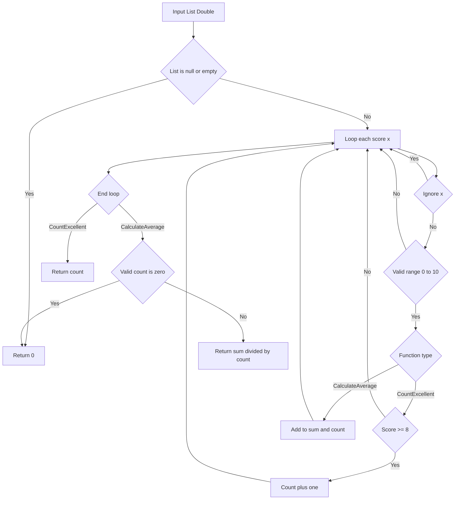

# Kiểm thử phần mềm

## T2 – 05/01/2026
### Luyện tập cùng **Can't Unsee**
- Ảnh số điểm đạt được: **7930 điểm**.

## T5 – 08/01/2026
### Bài tập thực hành kiểm thử với JUnit

#### Mục tiêu
- Viết kiểm thử đơn vị bằng **JUnit 5**.
- Kiểm thử chương trình phân tích điểm số học sinh.

#### Mô tả bài toán
Chương trình gồm lớp `StudentAnalyzer` với hai chức năng:
- Đếm số học sinh đạt loại Giỏi (điểm >= 8.0).
- Tính điểm trung bình các điểm hợp lệ trong khoảng **0 đến 10**.
- Các điểm **nhỏ hơn 0** hoặc **lớn hơn 10** được coi là dữ liệu không hợp lệ và bị bỏ qua.

#### Cấu trúc thư mục
Thư mục `unit-test`
 - Thư mục `src`
    - Tệp `StudentAnalyzer.java`
  - Thư mục `test`
    - Tệp `StudentAnalyzerTest.java`
  - Tệp `README.md`

#### Công nghệ sử dụng
- Java
- JUnit 5
- IntelliJ IDEA

#### Cách chạy kiểm thử
1. Mở project bằng **IntelliJ IDEA**.
2. Chuột phải vào lớp `StudentAnalyzerTest`.
3. Chọn **Run `StudentAnalyzerTest`**.
4. Kiểm tra kết quả tất cả test đều **PASSED**.

#### Kết quả
- Bộ kiểm thử đã đạt chuẩn theo kĩ thuật EP.
- Bộ kiểm thử đã đạt chuẩn theo kĩ thuật BVA.

#### Bảng quyết định

| Conditions / Actions        | TC1 | TC2 | TC3 | TC4 | TC5 | TC6 | TC7 | TC8 |
|----------------------------|:---:|:---:|:---:|:---:|:---:|:---:|:---:|:---:|
| **Conditions**             |     |     |     |     |     |     |     |     |
| List is null               |  Y  |  N  |  N  |  N  |  N  |  N  |  N  |  N  |
| List is empty              |  –  |  Y  |  N  |  N  |  N  |  N  |  N  |  N  |
| Score is null              |  –  |  –  |  Y  |  N  |  N  |  N  |  N  |  N  |
| Score is NaN / Infinity    |  –  |  –  |  N  |  Y  |  N  |  N  |  N  |  N  |
| Score < 0                  |  –  |  –  |  N  |  N  |  Y  |  N  |  N  |  N  |
| Score > 10                 |  –  |  –  |  N  |  N  |  N  |  Y  |  N  |  N  |
| Score in [0..10]           |  –  |  –  |  N  |  N  |  N  |  N  |  Y  |  Y  |
| Score ≥ 8                  |  –  |  –  |  –  |  –  |  –  |  –  |  N  |  Y  |
| **Actions**                |     |     |     |     |     |     |     |     |
| Return 0                   |  X  |  X  |     |     |     |     |     |     |
| Skip invalid / special      |     |     |  X  |  X  |  X  |  X  |     |     |
| Count excellent            |     |     |     |     |     |     |     |  X  |

#### Kiểm thử hộp trắng

## T5 - 22/1/2025
### Bài tập thực hành kiểm thử tự động End-to-End với Cypress

#### Mục tiêu
- Hiểu và thực hành các kịch bản kiểm thử tự động End-to-End (E2E).
- Sử dụng **Cypress** để kiểm thử trang web mẫu: [SauceDemo](https://www.saucedemo.com).

#### Công nghệ & Môi trường
- **Node.js** (v14+)
- **Cypress**
- **IDE:** Visual Studio Code

#### Cấu trúc thư mục
Thư mục `cypress-exercise`
  - `cypress/e2e/`
    - `login_spec.cy.js`: Chứa kịch bản kiểm thử đăng nhập.
    - `cart_spec.cy.js`: Chứa kịch bản kiểm thử giỏ hàng và thanh toán.

#### Các kịch bản kiểm thử đã thực hiện

**1. Kiểm thử Đăng nhập (`login_spec.cy.js`)**
-  **TC01:** Đăng nhập thành công với thông tin hợp lệ (`standard_user`).
-  **TC02:** Hiển thị thông báo lỗi khi đăng nhập thất bại (`invalid_user`).

**2. Kiểm thử Chức năng Giỏ hàng (`cart_spec.cy.js`)**
-  **TC03:** Thêm sản phẩm vào giỏ hàng (Check badge số lượng = 1).
-  **TC04:** Sắp xếp sản phẩm theo giá từ thấp đến cao (Price low to high).
-  **TC05 (Bài tập thêm):** Xóa sản phẩm khỏi giỏ hàng (Check badge về 0 hoặc ẩn).

**3. Kiểm thử Quy trình Thanh toán (`cart_spec.cy.js`)**
-  **TC06 (Bài tập thêm):** Quy trình Checkout hoàn chỉnh:
  - Đăng nhập -> Thêm hàng -> Checkout -> Điền thông tin (John Doe) -> Continue.
  - Xác minh chuyển hướng đến trang xác nhận (`/checkout-step-two.html`).

#### Hướng dẫn chạy kiểm thử
1. Mở terminal tại thư mục dự án.
2. Chạy lệnh: `npx cypress open`
3. Chọn **E2E Testing** -> Chọn trình duyệt (Chrome/Electron).
4. Click vào từng Spec file để xem kết quả chạy tự động.

